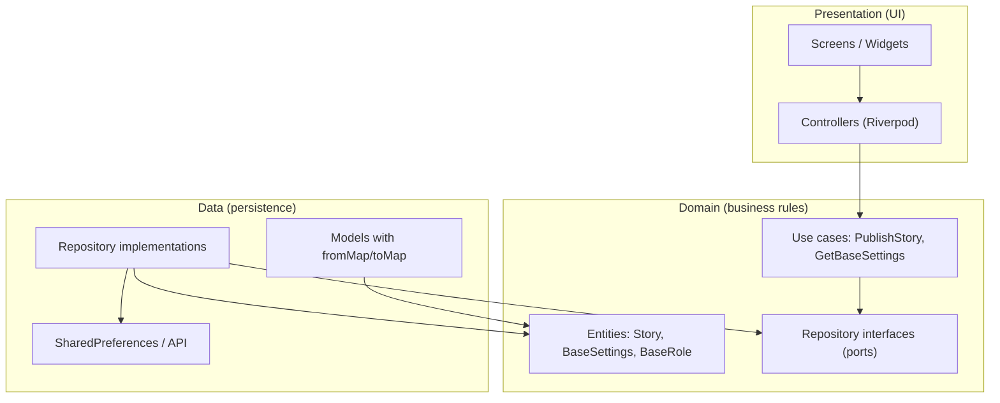
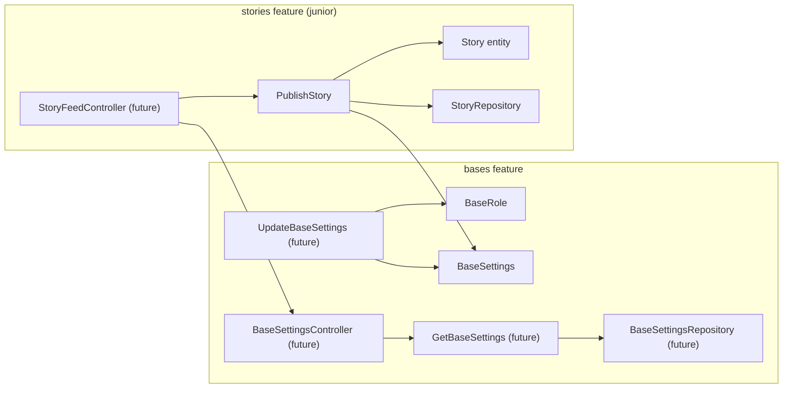

# Stories × Bases — Mentor Briefing (Step 1 Complete)

| Field | Value |
| --- | --- |
| **Audience** | Mentor preparing for a live session with the junior developer |
| **Branch** | `phase3-stories` |
| **Step 1 commit** | `0aa7331` — `feat(stories): implement BaseRole and BaseSettings domain entities (Step 1)` |
| **Junior starts at** | Step 2 in [`STORIES_FIRST_STEPS.md`](STORIES_FIRST_STEPS.md) |
| **Companion docs** | [`STORIES_FIRST_STEPS_REFERENCE.md`](STORIES_FIRST_STEPS_REFERENCE.md), [`STORIES_STARTER_SCAFFOLD.md`](STORIES_STARTER_SCAFFOLD.md), [`CHAT_ARCHITECTURE_DEMO_GUIDE.md`](CHAT_ARCHITECTURE_DEMO_GUIDE.md) |

---

## 1. What we landed (Step 1)

Two **domain entities** under the bases feature — shared infrastructure Stories depends on:

| File | What it is |
| --- | --- |
| `lib/features/bases/domain/entities/base_role.dart` | Who can do privileged actions in a base |
| `lib/features/bases/domain/entities/base_settings.dart` | Per-base configuration for Stories behavior |

These are **not** UI, **not** database code, and **not** network code. They are plain Dart types that describe business concepts. Widgets, SharedPreferences, and API wiring come later and **use** these types.

**Junior pull command:**

```powershell
git checkout phase3-stories
git pull origin phase3-stories
```

---

## 2. Architecture in one picture

The app is organized in **layers**. Data flows downward through dependencies; inner layers never know about outer ones.



**Rule the junior must internalize:**  
A use case in `stories/` may **import** an entity from `bases/domain/entities/`. It may **not** import anything from `bases/data/` or call SharedPreferences directly.

---

## 3. Design decisions — `BaseRole`

### What problem it solves

Every base has members with different authority. Some actions (delete someone else's story, change TTL, toggle archive) require **owner or admin**. Members cannot.

### What we chose (and why)

| Decision | Rationale |
| --- | --- |
| **Plain `enum`** with three values: `owner`, `admin`, `member` | MVP scope per DoD §2.1.2. No extra roles until product asks for them. |
| **`isOwnerOrAdmin` getter** | Every permission check asks the same question. One getter keeps use cases readable instead of two equality checks scattered everywhere. |
| **No JSON / no `fromString` on the enum** | Domain stays pure. The **data layer model** converts strings → `BaseRole` when settings are loaded from disk. |
| **Separate file from `BaseSettings`** | Role describes **membership**; settings describe **configuration**. Different lifecycles, different repositories later. |
| **New file, not legacy `lib/legacy/models/enums.dart`** | Legacy code is a wide prototype. Phase 3 domain entities are narrow, testable, and aligned with Clean Architecture. Legacy stays until Phase 4 retirement. |

### When Stories uses it

**Not in the junior's first-week scope (Steps 2–5).** `BaseRole` matters later for:

- `DeleteStory` — author **or** owner/admin can delete
- `UpdateBaseSettings` — only owner/admin can change TTL / archive toggle

The junior's `PublishStory` use case does **not** need `BaseRole` yet.

---

## 4. Design decisions — `BaseSettings`

### What problem it solves

Stories behavior varies **per base**: Are stories on? Should expired stories go to Highlights archive or be deleted? How long does a story live? How many media attachments?

The **base owner** controls these. Stories code must **respect** them on every publish, list, and expiry sweep.

### Field reference

| Field | Default | Purpose |
| --- | --- | --- |
| `baseId` | required | Which base these settings belong to |
| `storiesEnabled` | `true` | Master switch — if false, publish is rejected |
| `storiesArchiveEnabled` | `true` | If true, expired stories → archive; if false, hard-delete + remove media file |
| `storyTtl` | `24 hours` | How long a story stays in the active feed |
| `maxMediaPerStory` | `1` | MVP cap (enforced structurally: `Story` has one `MediaRef`, not a list) |
| `updatedAt` | required | Audit: when settings last changed |
| `updatedByUserId` | required | Audit: who changed them |

### What we chose (and why)

| Decision | Rationale |
| --- | --- |
| **`@immutable` value class** | Settings are replaced wholesale (`copyWith`), never mutated in place. Same pattern as `MediaRef` and `Message`. |
| **Typed IDs (`BaseId`, `UserId`)** not raw `String` | Compiler catches mixing up IDs. Consistent with the rest of Phase 3. |
| **Defaults in constructor** | Sensible MVP behavior without extra wiring. A new base "just works" for Stories until an owner changes settings. |
| **`copyWith`, `==`, `hashCode` by hand** | Project does not use `Equatable`. Explicit equality makes tests and state diffing predictable. |
| **No `fromJson` / `toMap` on the entity** | Serialization is a **data layer** concern (`BaseSettingsModel`). Domain entity = business shape only. |
| **Narrow MVP vs legacy `BaseSettings`** | Legacy has live-streaming flags, post approval, allowed media types, etc. We took only what Slice B needs. |
| **Audit fields (`updatedAt`, `updatedByUserId`)** | Required by DoD even before UI shows them. Future settings screen and sync need provenance. |

### What we deliberately omitted (for now)

- Repository, data source, settings screen (DoD §2.1.2–2.1.4) — mentor / later sprint
- `toString()` — optional; add when debugging needs it

---

## 5. Technical primer (4th-year dev, new to async / use cases)

### 5.1 Domain entity — "struct with rules attached"

`BaseSettings` is a **bundle of values** that travels through the app:

```dart
final settings = BaseSettings(
  baseId: const BaseId('b1'),
  updatedAt: DateTime.utc(2026, 6, 22),
  updatedByUserId: const UserId('u1'),
);
```

- **`const` constructor** — can be created at compile time when all args are known
- **`final` fields** — cannot change after construction; use `copyWith` to produce a new instance
- **No methods that touch disk or network** — it's just data

### 5.2 Use case — "one application action, one class"

A **use case** is a single thing the app can *do*: publish a story, send a message, get base settings.

Pattern in this project:

```dart
class PublishStory implements UseCase<Story, PublishStoryParams> {
  const PublishStory(this.repo);
  final StoryRepository repo;

  @override
  Future<Either<Failure, Story>> call(PublishStoryParams p) async {
    // validate → delegate to repository
  }
}
```

| Piece | Meaning |
| --- | --- |
| `UseCase<Story, PublishStoryParams>` | Input = params, output = `Story` on success |
| `Future<...>` | Work may take time (disk, network). `Future` = "result later". You `await` it in controllers. |
| `Either<Failure, Story>` | **Not** throw on error. Returns **Left** (failure) or **Right** (success). |
| `repo` in constructor | Use case has **one** collaborator. Injected once, reused for every `call`. |
| `call(p)` | The actual operation. |

**Chat mirror to study:** `lib/features/chat/domain/usecases/send_message.dart` — validate trimmed content, forward to repo. Same shape as `PublishStory`, simpler validation.

### 5.3 Repository (port) — "interface to persistence"

```dart
abstract class StoryRepository {
  Future<Either<Failure, Story>> publishStory({ ... });
}
```

The **domain layer** defines *what* storage must do, not *how*. Implementation (`StoryRepositoryImpl` + SharedPreferences) comes in the data layer later.

Use cases talk to the **interface**. Tests swap in a **mock** — no real disk needed.

### 5.4 Controller — "UI's brain; joins features"

Controllers (Riverpod `StateNotifier`) sit in **presentation**:

1. Read user input from widgets
2. Load any cross-feature data needed (e.g. current `BaseSettings`)
3. Call use case(s)
4. Translate `Either` → UI state (`AsyncValue`, error snackbars)

**Critical rule for bases ↔ stories:**

> **Use cases do not fetch `BaseSettings`.**  
> The **controller** loads settings (via `GetBaseSettings`, later) and **passes them into** `PublishStoryParams`.

Why?

- `PublishStory` tests need only **one** mock (`StoryRepository`), not two
- Stories domain doesn't depend on bases repository
- Clear boundary: controller = orchestrator; use case = validate + delegate

### 5.5 Async in plain terms

```dart
final result = await useCase(params);
```

- `await` pauses until the `Future` completes
- In **tests**, use `await` the same way — no widgets required
- In **controllers**, `await` then branch on `result.match(...)` or `result.isLeft`

The junior's Step 5 tests are **fully synchronous from their perspective** — they `await` the use case and assert on the returned `Either`. No streams in Step 5.

### 5.6 `Either` without theory overload

```dart
// Success path
Right(story)

// Failure path
Left(ValidationFailure('Stories are disabled for this base.'))
```

In tests:

```dart
expect(result.isLeft, isTrue);
expect(result, isA<Left<Failure, Story>>());
```

In controllers (later):

```dart
result.match(
  (failure) => showError(failure.message),
  (story)   => refreshFeed(),
);
```

**No `try/catch` in use cases.** Repositories wrap I/O with `guard(...)` and return `Left` on exceptions.

---

## 6. How bases slice interacts with stories slice

### 6.1 Dependency direction



**Stories → Bases:** imports **entities only** (`BaseSettings`, later `BaseRole`).  
**Bases → Stories:** no imports. Bases does not know Stories exists.

### 6.2 Data flow: publishing a story (end state)

When the full slice is wired, publish looks like this:

```
User taps Publish
    ↓
StoryCaptureScreen (widget)
    ↓
StoryFeedController.publish(...)
    ↓ reads current settings once
BaseSettingsController.state  →  BaseSettings
    ↓ builds params
PublishStoryParams(baseId, authorUserId, media, caption, settings)
    ↓
PublishStory.call(params)
    ├─ if !settings.storiesEnabled → Left(ValidationFailure)
    ├─ if caption too long           → Left(ValidationFailure)
    └─ else → StoryRepository.publishStory(ttl: settings.storyTtl, ...)
              ↓
         SharedPreferences + file storage (data layer, later)
```

**What Step 1 gives the junior today:** the `BaseSettings` **type** inside `PublishStoryParams`. Tests construct it inline — no controller or repository yet.

### 6.3 Which `BaseSettings` fields the junior touches when

| Step / use case | Fields used |
| --- | --- |
| **Step 5 — `PublishStory`** | `storiesEnabled`, `storyTtl` |
| **Later — `ListArchivedStories`** | `storiesArchiveEnabled` |
| **Later — `ExpireAndArchiveStories`** (repo sweep) | `storiesArchiveEnabled` |
| **Later — settings screen** | all fields via `UpdateBaseSettings` |
| **`maxMediaPerStory`** | On entity for DoD; MVP enforced by single `MediaRef` in `Story` / params |

### 6.4 Which `BaseRole` fields the junior touches when

| Step / use case | Role check |
| --- | --- |
| **Steps 2–5** | None |
| **Later — `DeleteStory`** | `actingRole.isOwnerOrAdmin` OR author == acting user |
| **Later — `UpdateBaseSettings`** | Must be owner or admin |

---

## 7. Legacy vs new — avoid this footgun

Two similarly named types exist:

| | Legacy (ignore for Stories) | New (use this) |
| --- | --- | --- |
| Role | `lib/legacy/models/enums.dart` | `lib/features/bases/domain/entities/base_role.dart` |
| Settings | `lib/legacy/models/base_settings.dart` | `lib/features/bases/domain/entities/base_settings.dart` |

Stories imports must use:

```dart
import 'package:moonbase_skeleton/features/bases/domain/entities/base_settings.dart';
```

Legacy stays for old screens until Phase 4. Do not extend legacy for new Stories work.

---

## 8. Junior scope after Step 1

| Step | Owner | Status |
| --- | --- | --- |
| 0 — Tracer bullet (read chat) | Junior | Should be done |
| 1 — `BaseRole`, `BaseSettings` | Mentor | **Done — `0aa7331`** |
| 2 — `Story` entity | Junior | **Next** |
| 3 — `story_providers.dart` | Junior | |
| 4 — `StoryRepository` port | Junior | |
| 5 — `PublishStory` + test | Junior | |
| 6 — Draft PR | Junior | |

**Verify commands for the junior:**

```powershell
fvm flutter analyze lib/features/stories/
fvm flutter test test/features/stories/
```

---

## 9. Suggested 10-minute verbal opener (live session)

1. *"Step 1 is done on the branch — pull `phase3-stories`. You're starting at Step 2, the `Story` entity."*
2. *"Bases and Stories are separate folders, but Stories **consumes** `BaseSettings` as data passed into use cases — it never loads settings itself."*
3. *"A use case is one action: validate inputs, call the repository, return success or failure — no UI, no SharedPreferences."*
4. *"`Future` means the answer comes later; `Either` means success **or** failure without throwing."*
5. *"Your first test will mock the repository and pass a fake `BaseSettings` — that's why we built it first."*
6. *"Chat is your template. Open `SendMessage` and `ChatController` side by side with `PublishStory` as you go."*

---

## 10. Mentor backlog (not blocking junior Steps 2–6)

These complete the **bases** slice per DoD §2.1.2–2.1.4:

- `BaseSettingsRepository` + SharedPreferences data source
- `GetBaseSettings` / `UpdateBaseSettings` use cases
- `BaseSettingsController` + owner settings screen
- `main.dart` provider overrides
- Rebase `phase3-stories` onto latest `main` (optional, for media polish alignment)

---

## Related documents

- [`STORIES_FIRST_STEPS.md`](STORIES_FIRST_STEPS.md) — junior's primary guide (start Step 2)
- [`STORIES_FIRST_STEPS_REFERENCE.md`](STORIES_FIRST_STEPS_REFERENCE.md) — worked solutions when stuck
- [`STORIES_STARTER_SCAFFOLD.md`](STORIES_STARTER_SCAFFOLD.md) — copy-paste bootstrap for Steps 1–5
- [`STORIES_FEATURE_REQUEST.md`](STORIES_FEATURE_REQUEST.md) — full ticket and acceptance criteria
- [`CHAT_ARCHITECTURE_DEMO_GUIDE.md`](CHAT_ARCHITECTURE_DEMO_GUIDE.md) — live trace demo through chat slice
- [`../docs/PHASE3_DOD_ACTION_LIST.md`](../docs/PHASE3_DOD_ACTION_LIST.md) — DoD §2.1 and §2.2
