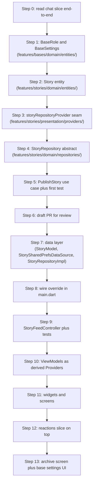

# Stories — First Steps (Solo Guide)

> **How to use this document.** This is your primary guide for the first week of work on the Stories feature ticket ([`STORIES_FEATURE_REQUEST.md`](STORIES_FEATURE_REQUEST.md)). It tells you **what** to build and in **what order**, but withholds the actual Dart. The point is for you to produce the code yourself by mirroring the existing chat feature. When genuinely stuck — not just slow — consult [`STORIES_FIRST_STEPS_REFERENCE.md`](STORIES_FIRST_STEPS_REFERENCE.md) for a worked solution. Try not to peek for at least 30 minutes per step.

---

## Table of Contents

1. [The order matters more than the code](#1-the-order-matters-more-than-the-code)
2. [Step 0 — Tracer bullet (no code yet)](#2-step-0--tracer-bullet-no-code-yet)
3. [Step 1 — Promote `BaseRole` and `BaseSettings` to the domain layer](#3-step-1--promote-baserole-and-basesettings-to-the-domain-layer)
4. [Step 2 — Define the `Story` domain entity](#4-step-2--define-the-story-domain-entity)
5. [Step 3 — Drop in the provider seam](#5-step-3--drop-in-the-provider-seam)
6. [Step 4 — First abstract repository port](#6-step-4--first-abstract-repository-port)
7. [Step 5 — First use case with real validation](#7-step-5--first-use-case-with-real-validation)
8. [Step 6 — Stop and push a draft PR](#8-step-6--stop-and-push-a-draft-pr)
9. [What you should explicitly NOT touch yet](#9-what-you-should-explicitly-not-touch-yet)
10. [Sequencing one-pager](#10-sequencing-one-pager)

---

## 1. The order matters more than the code

Your biggest temptation will be to jump straight to a widget that renders something. There will be nothing to render for the first two days. That is expected, and the reasoning matters. The active ticket is Stories (Slice B). Posts (Slice C) reuses the same shared scaffolding (`MediaRef`, `BaseSettings`, the `Either` plumbing, the `{required local, this.remote}` repo pattern). Building Stories first means Posts becomes a recognition exercise, not a fresh climb.

Build dependency-first. Domain layer (entities → ports → use cases) before anything else. No widgets, no `SharedPreferences`, no `image_picker` calls in the first six steps.

---

## 2. Step 0 — Tracer bullet (no code yet)

**Do this before touching a single file.** Read the chat feature end-to-end, in this dependency order, and trace one user intent (typing a message, hitting send, seeing it appear in the list) through every layer:

1. [`lib/features/chat/domain/entities/message.dart`](../lib/features/chat/domain/entities/message.dart) — what a domain entity looks like.
2. [`lib/features/chat/domain/repositories/chat_repository.dart`](../lib/features/chat/domain/repositories/chat_repository.dart) — abstract port.
3. [`lib/features/chat/domain/usecases/send_message.dart`](../lib/features/chat/domain/usecases/send_message.dart) — input validation + repo call returning `Either<Failure, T>`.
4. [`lib/features/chat/data/datasources/chat_shared_prefs_data_source.dart`](../lib/features/chat/data/datasources/chat_shared_prefs_data_source.dart) — local data source with a `StreamController.broadcast()` per base.
5. [`lib/features/chat/data/repositories/chat_repository_impl.dart`](../lib/features/chat/data/repositories/chat_repository_impl.dart) — `guard(...)` wrapper, model→entity conversion, `{required local, this.remote}` shape.
6. [`lib/features/chat/presentation/providers/chat_providers.dart`](../lib/features/chat/presentation/providers/chat_providers.dart) — provider tokens that throw `UnimplementedError` until wired in `main.dart`.
7. [`lib/features/chat/presentation/controllers/chat_controller.dart`](../lib/features/chat/presentation/controllers/chat_controller.dart) — `StateNotifier<ChatState>`, `AsyncValue<List<Message>>`, stream subscription, `res.match(...)` at the boundary.
8. [`lib/features/chat/presentation/viewmodels/chat_screen_vm.dart`](../lib/features/chat/presentation/viewmodels/chat_screen_vm.dart) + [`chat_screen_vm_provider.dart`](../lib/features/chat/presentation/providers/chat_screen_vm_provider.dart) — VM as a derived `Provider`.
9. [`lib/main.dart`](../lib/main.dart) — repo override at the `ProviderScope`.

**Reasoning.** The feature request keeps telling you to mirror the chat feature. That instruction is empty until you have actually seen what mirror means at the file level. The chat slice is the only complete vertical slice currently in the project. Everything you write will be structurally identical to those nine files — just with `Story` where `Message` is.

**Done when.** You can describe in one paragraph "what flows where when a user hits send." If you cannot, do not start writing code yet.

---

## 3. Step 1 — Promote `BaseRole` and `BaseSettings` to the domain layer

**Why first.** Story publish flow reads the base's `storyTtl` and `maxMediaPerStory` to clamp values; story deletion checks the actor's `BaseRole`. So `BaseSettings` and `BaseRole` are upstream dependencies of literally everything in Slice B. They also live today in `lib/legacy/models/` ([`base_settings.dart`](../lib/legacy/models/base_settings.dart), [`enums.dart`](../lib/legacy/models/enums.dart)) with a much wider field surface than the DoD requires.

**What to do.** Create two new files in the bases feature domain layer. Do **not** delete the legacy ones — they aren't imported by any active feature, so leaving them keeps test regressions from biting while you work.

### 3.1 `lib/features/bases/domain/entities/base_role.dart`

- A single `enum BaseRole` with three values: `owner`, `admin`, `member`.
- Add a convenience getter `bool get isOwnerOrAdmin` on the enum so use cases can ask one question instead of comparing twice.

### 3.2 `lib/features/bases/domain/entities/base_settings.dart`

- An `@immutable` value class. Look at [`MediaRef`](../lib/features/media/domain/entities/media_ref.dart) for the canonical shape.
- Fields per the Phase 3 DoD MVP scope (Section 2.1.1 of the feature request):
  - `BaseId baseId`
  - `bool storiesEnabled` (default `true`)
  - `bool storiesArchiveEnabled` (default `true`)
  - `Duration storyTtl` (default `Duration(hours: 24)`)
  - `int maxMediaPerStory` (default `1`)
  - `DateTime updatedAt`
  - `UserId updatedByUserId`
- Provide `copyWith`, `==`, `hashCode`. **No** `fromJson` / `toMap` — those belong on the `BaseSettingsModel` in the data layer (you'll write that later).

> **Lint constraints to honor (will burn you if ignored).**
>
> - `always_use_package_imports` — never use relative imports inside `lib/`.
> - `sort_constructors_first` — constructor block before any field declarations.
> - `prefer_const_constructors_in_immutables` — constructor must be `const`.
> - `prefer_single_quotes` — use `'` not `"`.

**Reasoning — four discipline points to internalize from this file:**

- **Typed IDs everywhere** (`BaseId`, `UserId`) — never raw `String`. That's why [`lib/core/ids.dart`](../lib/core/ids.dart) exists.
- **No serialization on the entity.** Domain entities are pure value objects. Anything that mentions `dart:convert` or `Map<String, dynamic>` belongs in `data/models/`.
- **`@immutable` + manual `==` / `hashCode`** because the project does not depend on `Equatable`. Match the pattern in [`MediaRef`](../lib/features/media/domain/entities/media_ref.dart).
- **MVP shape only.** The legacy `BaseSettings` has many more fields (live-streaming flag, allowed media types, post approval, etc.). Don't carry those over. A narrower domain entity is easier to evolve.

**Common mistakes.**
- Copying the legacy `String baseId` instead of using `BaseId baseId`.
- Forgetting `@immutable` (you'll get analyzer warnings but they're easy to overlook).
- Putting the field declarations before the constructor (sort-constructors-first lint).

**Done when.** `fvm flutter analyze` is clean on both new files, and you can construct one in a Dart scratch file using only `package:moonbase_skeleton/...` imports.

---

## 4. Step 2 — Define the `Story` domain entity

**File:** `lib/features/stories/domain/entities/story.dart`

- `@immutable` class `Story`. Mirror [`MediaRef`](../lib/features/media/domain/entities/media_ref.dart) and your new `BaseSettings` for shape.
- Fields:
  - `StoryId id`
  - `BaseId baseId`
  - `UserId authorUserId`
  - `MediaRef media` — **singular**, not a list (Phase 3 caps stories at one media per story; enforce this at the type level)
  - `String? caption`
  - `Duration ttl`
  - `DateTime createdAt`
  - `bool archived` (default `false`)
  - `SyncStatus syncStatus` (default `SyncStatus.synced`)
- A computed `bool get isExpired` that returns `DateTime.now().isAfter(createdAt.add(ttl))`. **No clock injection** — the repository's sweep is the only production caller; if you later need to unit-test this getter in isolation, that's when you'd add a `Clock` parameter, not before.
- `copyWith`, `==`, `hashCode`.

> **Pitfall — `MediaRef media` (singular).** If you write `List<MediaRef> media` here, you have misread the DoD. Posts will have a list; Stories never do.

> **Pitfall — `syncStatus` default.** Every entity that carries media gets `syncStatus = SyncStatus.synced` in Phase 3. That's how Phase 4 outbox sync slots in mechanically. Do not omit the field or change the default.

> **Pitfall — `archived` vs `isExpired`.** They are orthogonal. Expired = past TTL. Archived = the repository chose to keep it after expiry. `isExpired` must not check `archived`; the repository sweep flips `archived = true` on expired rows when the base allows archiving.

**Reasoning.** A single import block should already make the layering visible to you — three of your imports are from `core/`, one from `features/media/domain/`. Zero from `data/`, zero from `presentation/`, zero from `dart:io`. If your import list grows beyond that shape, stop and rethink.

**Done when.** `Story` can be constructed in a test file with only `package:moonbase_skeleton/...` imports, `isExpired` returns `false` for a freshly created story, and `==` returns `true` for two `Story` instances built with identical field values.

---

## 5. Step 3 — Drop in the provider seam

**File:** `lib/features/stories/presentation/providers/story_providers.dart`

- One `final storyRepositoryProvider = Provider<StoryRepository>((ref) { ... });` that **throws** `UnimplementedError` with a message pointing to `lib/main.dart`. Copy the shape from [`chat_providers.dart`](../lib/features/chat/presentation/providers/chat_providers.dart) lines 8–10.
- Leave a commented placeholder for the use case providers you will add later (`publishStoryUseCaseProvider`, `listActiveStoriesUseCaseProvider`, etc.). They cannot exist until their use cases do.

**Reasoning — this is a non-obvious pattern. Pause on it.** The chat feature exposes a `chatRepositoryProvider` that **throws** until `main.dart` provides an override. That seems backwards on first reading ("why have a provider that always throws?"), but it's the project's substitute for a DI container:

- The domain and presentation layers depend only on the **token** (`storyRepositoryProvider`) and the **abstract type** (`StoryRepository`).
- The concrete implementation (`StoryRepositoryImpl`, with all its `SharedPreferences` and `MediaStorage` baggage) only gets imported in **`lib/main.dart`** when the override is set up.
- This means you can write `PublishStory`, `ListActiveStories`, and `StoryFeedController` against the abstract repo and **none of them transitively import `dart:io` or `shared_preferences`**. That's the "data depends on domain, presentation depends on domain, neither depends on the other" rule from the assignment doc Section 2.

**Smoke alarm.** If you ever find yourself importing `package:shared_preferences` or `dart:io` from anywhere outside `lib/features/stories/data/datasources/`, stop and re-read this step.

**Done when.** The file compiles, `fvm flutter analyze` is clean, and reading the provider at this point in the project would throw `UnimplementedError` (which is correct — nothing wires it yet).

---

## 6. Step 4 — First abstract repository port

**File:** `lib/features/stories/domain/repositories/story_repository.dart`

Define an abstract class `StoryRepository` with these methods. Mirror [`ChatRepository`](../lib/features/chat/domain/repositories/chat_repository.dart) for shape and doc-comment style.

| Method | Signature (high level) | Notes |
| --- | --- | --- |
| `publishStory` | takes `BaseId`, `UserId`, `MediaRef`, `Duration ttl`, optional `String? caption`; returns `Future<Either<Failure, Story>>` | Does **not** take a `Story` — `id`, `createdAt`, `syncStatus` are repository concerns |
| `streamActive` | takes `BaseId`; returns `Stream<List<Story>>` | The repository filters expired rows on every tick. Controllers never see expired stories. |
| `listActive` | takes `BaseId`; returns `Future<Either<Failure, List<Story>>>` | For the initial paint before the stream's first emission |
| `listArchive` | takes `BaseId`; returns `Future<Either<Failure, List<Story>>>` | |
| `deleteStory` | takes `StoryId`; returns `Future<Either<Failure, Unit>>` | Use `Unit` from `package:moonbase_skeleton/core/either.dart`, not `void` |
| `expireAndArchive` | takes `BaseId`; returns `Future<Either<Failure, Unit>>` | Sweep job. Archives expired rows when `storiesArchiveEnabled`; otherwise hard-deletes and calls `MediaStorage.delete` |

**Reasoning — three subtle but important choices.**

- **No `Story` instance gets passed in to `publishStory`.** The use case hands the repo the *content*; the repo produces the *entity*. This mirrors how `ChatRepository.sendMessage` takes `content` (a `String`), not a `Message`. Why? Because `id`, `createdAt`, and `syncStatus` are repository concerns (UUID generation, server-authoritative timestamps in Phase 4, sync state machine).
- **`Stream<List<Story>>` is the source of truth, not the `Future`.** The controller subscribes to the stream; the `Future`-returning `listActive` is only for the initial paint. Same pattern as `ChatRepository.streamMessages` + `listMessages`.
- **`Unit` instead of `void`.** [`lib/core/either.dart`](../lib/core/either.dart) has a `Unit` type. Use it: `Either<Failure, Unit>` is type-safe; `Either<Failure, void>` makes pattern matching awkward.

**Common mistakes.**
- Returning `void` instead of `Unit`.
- Adding a `Future<Story?> getStory(StoryId)` method "just in case" — YAGNI. The DoD has no use case that needs it.
- Putting the filtering responsibility on the controller. It belongs in the repo; document it in the doc-comment.

**Done when.** The abstract class compiles, has doc-comments on the load-bearing methods (`streamActive`, `expireAndArchive`), and contains zero imports from `data/` or `presentation/`.

---

## 7. Step 5 — First use case with real validation

**File:** `lib/features/stories/domain/usecases/publish_story.dart`

Two artifacts in one file:

1. **`PublishStoryParams`** — a value class holding `BaseId baseId`, `UserId authorUserId`, `MediaRef media`, optional `String? caption`, and a `BaseSettings settings`. The caller (the controller) is responsible for reading current `BaseSettings` and passing it in; use cases do **not** reach across repositories.
2. **`PublishStory implements UseCase<Story, PublishStoryParams>`** — a constructor takes a `StoryRepository repo` and stores it as a `final` field. The `call(p)` method:
   - Returns `Left(ValidationFailure(...))` if `!p.settings.storiesEnabled`.
   - Trims the caption.
   - Returns `Left(ValidationFailure(...))` if the trimmed caption is longer than 280 characters.
   - Otherwise forwards to `repo.publishStory(...)` with the trimmed caption (treating an empty trimmed string as `null`) and `ttl: p.settings.storyTtl`.

> **Pitfall — no `try`/`catch` in this file.** Failures from the repository come back as `Left(Failure)` because the repo wrapped its IO with `guard(...)`. If you feel the urge to add a `try` here, that's the signal you're about to violate the failure-handling rule from the feature request Section 2.4.

> **Pitfall — store the repo on the use case, not on the params.** The use case has one collaborator (`StoryRepository`); inject in the constructor. The params struct holds only what the *caller* provides per call.

**Reasoning — three big lessons in 30 lines.**

1. **Validation lives in the use case, not the repository and not the widget.** The repo's job is "persist this." The widget's job is "collect and display." Everything between is the use case's job. If you put a `text.length > 280` check in the widget, the same check has to be duplicated for every code path that ever creates a story. Centralizing it makes "what is a valid Story?" answerable by reading one file.
2. **Use cases consume `BaseSettings`, they don't fetch it.** The controller will fetch it via `BaseSettingsController` and pass it in. This keeps the use case mockable in tests with one fake (`StoryRepository`) instead of two.
3. **`Either` is the contract, not exceptions.** Read [`lib/core/usecase.dart`](../lib/core/usecase.dart) and [`lib/core/either.dart`](../lib/core/either.dart) until the `match((l) => ..., (r) => ...)` idiom feels natural. You will write this pattern dozens of times.

### 7.1 Your first test

Once `PublishStory` compiles, write `test/features/stories/domain/usecases/publish_story_test.dart` with three test cases:

| Test name | Setup | Expectation |
| --- | --- | --- |
| `rejects when storiesEnabled is false` | `settings.copyWith(storiesEnabled: false)` | Result is a `Left`; the repo was **never** called (`verifyNever`) |
| `rejects captions over 280 chars` | `caption = 'x' * 281` | Result is a `Left` with `ValidationFailure`; repo never called |
| `trims caption and forwards to repo on success` | Stub `repo.publishStory(...)` to return `Right(fakeStory)`; pass `caption = '  hello  '` | Result is a `Right`; verify the repo was called with `caption: 'hello'` exactly once |

Use `mocktail` (already in [`pubspec.yaml`](../pubspec.yaml) dev_dependencies):

```dart
class _MockStoryRepo extends Mock implements StoryRepository {}
```

> **The payoff to feel here.** You can fully test the use case without a single line of widget code, without `SharedPreferences`, and without the file system. That is the moment "why all this boilerplate?" usually clicks for a junior developer. Sit with it.

**Done when.** Three tests pass. `fvm flutter analyze` is clean. `fvm dart format --set-exit-if-changed .` is clean.

---

## 8. Step 6 — Stop and push a draft PR

By this point you have six files written, the project still compiles (no widget code has been added, so nothing renders), `flutter analyze` is green, and the first use case has three passing tests. **This is the right place to push a draft PR** even though the user-visible feature is zero percent done.

**Branch and PR conventions:** see [`docs/DEVELOPMENT_SETUP.md`](../docs/DEVELOPMENT_SETUP.md) Section 4. Suggested PR title:

```
feat(stories): scaffold domain layer (entity, repo port, publish use case)
```

**Why push so early.**

- It lets your reviewer catch architectural drift after 200 lines instead of after 2,000.
- It establishes momentum and confidence.
- It separates the structural review ("does the layering and entity shape look right?") from the implementation review ("does the `SharedPreferences` key layout match the spec?"). The two are easier to review independently.

In the PR description, cite the DoD section (Section 2 of [`PHASE3_DOD_ACTION_LIST.md`](../docs/PHASE3_DOD_ACTION_LIST.md)) and the blueprint sections you implemented against. Use the template in [`docs/DEVELOPMENT_SETUP.md`](../docs/DEVELOPMENT_SETUP.md) Section 4.3.

---

## 9. What you should explicitly NOT touch yet

A junior's instinct is to make something visible on screen as fast as possible. That instinct produces tangled features in this architecture. The following are deliberately deferred:

1. **No widgets, no screens, no router edits.** There is no controller for a widget to read yet, and no provider override in `main.dart` for a controller to construct against.
2. **No `image_picker` / camera code.** `PickAndPersistMedia` already exists in [`lib/features/media/domain/usecases/pick_and_persist_media.dart`](../lib/features/media/domain/usecases/pick_and_persist_media.dart). When you get to the capture screen, you call *that*; you do not import `image_picker` from anywhere under `stories/`.
3. **No `SharedPreferences` calls anywhere.** That's the very last layer you wire, and it lives only in `lib/features/stories/data/datasources/story_shared_prefs_data_source.dart`. Until then, controllers and use cases run against mocked `StoryRepository` in tests.
4. **No reactions yet.** Reactions are an independent slice that *applies to* stories. Build the Story core first, get it visible, then add reactions on top. Splitting reduces blast radius if something goes wrong.
5. **No Posts work yet.** Posts is structurally identical to Stories but with `List<MediaRef> media` and no TTL. You will move 4× faster on Posts after Stories ships precisely because you won't be learning the architecture during it.

---

## 10. Sequencing one-pager



If you finish through Step 6 by end of week one, you're on track. If you're blocked anywhere from Step 0 to Step 5, the block is almost always **"I don't understand the chat slice well enough"** — and the fix is to go back to Step 0, not to push forward.

---

## Related documents

- [`STORIES_FEATURE_REQUEST.md`](STORIES_FEATURE_REQUEST.md) — the full ticket. Read first if you haven't.
- [`STORIES_FIRST_STEPS_REFERENCE.md`](STORIES_FIRST_STEPS_REFERENCE.md) — worked Dart for each step. Use sparingly; the value of this assignment comes from producing the code yourself.
- [`../docs/PHASE3_POSTS_STORIES_REACTIONS_BLUEPRINT.md`](../docs/PHASE3_POSTS_STORIES_REACTIONS_BLUEPRINT.md) — architectural blueprint.
- [`../docs/PHASE3_DOD_ACTION_LIST.md`](../docs/PHASE3_DOD_ACTION_LIST.md) — slice-level DoD.
- [`../docs/DEVELOPMENT_SETUP.md`](../docs/DEVELOPMENT_SETUP.md) — toolchain, lint config, git workflow.
