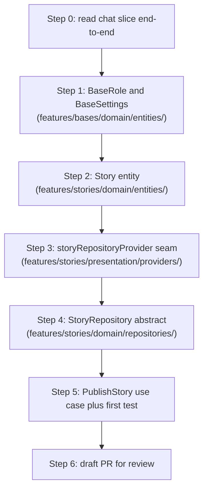

# Stories — First Steps (Reference Solution)

> **How to use this document.** This is the worked-code companion to [`STORIES_FIRST_STEPS.md`](STORIES_FIRST_STEPS.md). It contains one possible implementation of every file you'll produce in the first six steps. **Use sparingly.** The value of this assignment comes from producing the code yourself by mirroring the chat slice; if you copy-paste from here without first attempting each step on your own, you'll have boilerplate but no understanding. Suggested rule: spend at least 30 minutes per step in your own attempt before consulting this file, and even then, prefer reading the relevant section here, closing the file, and re-typing from memory.

---

## Table of Contents

1. [How this file is structured](#1-how-this-file-is-structured)
2. [Step 0 — Tracer bullet (no code)](#2-step-0--tracer-bullet-no-code)
3. [Step 1 — `BaseRole` and `BaseSettings`](#3-step-1--baserole-and-basesettings)
4. [Step 2 — `Story` entity](#4-step-2--story-entity)
5. [Step 3 — Provider seam](#5-step-3--provider-seam)
6. [Step 4 — `StoryRepository` port](#6-step-4--storyrepository-port)
7. [Step 5 — `PublishStory` use case and first test](#7-step-5--publishstory-use-case-and-first-test)
8. [Step 6 — Draft PR commit checklist](#8-step-6--draft-pr-commit-checklist)
9. [Sequencing one-pager](#9-sequencing-one-pager)

---

## 1. How this file is structured

For each step from the solo guide, this document repeats:

- The **file path** to create.
- The **full worked code** for that file.
- A short **commentary block** calling out the specific lines a reviewer would scrutinize.

The reasoning paragraphs from [`STORIES_FIRST_STEPS.md`](STORIES_FIRST_STEPS.md) are **not** duplicated here — read both files side by side.

---

## 2. Step 0 — Tracer bullet (no code)

No code in this step. See [`STORIES_FIRST_STEPS.md`](STORIES_FIRST_STEPS.md) Section 2.

---

## 3. Step 1 — `BaseRole` and `BaseSettings`

### 3.1 `lib/features/bases/domain/entities/base_role.dart`

```dart
enum BaseRole {
  owner,
  admin,
  member;

  bool get isOwnerOrAdmin => this == BaseRole.owner || this == BaseRole.admin;
}
```

**Commentary.**
- Three-line enum with one convenience getter. Resist the urge to add `fromString` / `toString` helpers — the model layer handles JSON conversion when it lands.
- The `isOwnerOrAdmin` getter exists so permission-check use cases read as one boolean (`if (actingRole.isOwnerOrAdmin) ...`) instead of two equality comparisons.

### 3.2 `lib/features/bases/domain/entities/base_settings.dart`

```dart
import 'package:flutter/foundation.dart';
import 'package:moonbase_skeleton/core/ids.dart';

/// MVP shape per Phase 3 DoD Section 2.1.1. Deliberately a narrower surface
/// than the legacy BaseSettings; the legacy class can be retired in Phase 4.
@immutable
class BaseSettings {
  const BaseSettings({
    required this.baseId,
    required this.updatedAt,
    required this.updatedByUserId,
    this.storiesEnabled = true,
    this.storiesArchiveEnabled = true,
    this.storyTtl = const Duration(hours: 24),
    this.maxMediaPerStory = 1,
  });

  final BaseId baseId;
  final bool storiesEnabled;
  final bool storiesArchiveEnabled;
  final Duration storyTtl;
  final int maxMediaPerStory;
  final DateTime updatedAt;
  final UserId updatedByUserId;

  BaseSettings copyWith({
    BaseId? baseId,
    bool? storiesEnabled,
    bool? storiesArchiveEnabled,
    Duration? storyTtl,
    int? maxMediaPerStory,
    DateTime? updatedAt,
    UserId? updatedByUserId,
  }) {
    return BaseSettings(
      baseId: baseId ?? this.baseId,
      storiesEnabled: storiesEnabled ?? this.storiesEnabled,
      storiesArchiveEnabled: storiesArchiveEnabled ?? this.storiesArchiveEnabled,
      storyTtl: storyTtl ?? this.storyTtl,
      maxMediaPerStory: maxMediaPerStory ?? this.maxMediaPerStory,
      updatedAt: updatedAt ?? this.updatedAt,
      updatedByUserId: updatedByUserId ?? this.updatedByUserId,
    );
  }

  @override
  bool operator ==(Object other) {
    if (identical(this, other)) return true;
    return other is BaseSettings &&
        other.baseId == baseId &&
        other.storiesEnabled == storiesEnabled &&
        other.storiesArchiveEnabled == storiesArchiveEnabled &&
        other.storyTtl == storyTtl &&
        other.maxMediaPerStory == maxMediaPerStory &&
        other.updatedAt == updatedAt &&
        other.updatedByUserId == updatedByUserId;
  }

  @override
  int get hashCode => Object.hash(
        baseId,
        storiesEnabled,
        storiesArchiveEnabled,
        storyTtl,
        maxMediaPerStory,
        updatedAt,
        updatedByUserId,
      );
}
```

**Commentary.**
- The two imports — `flutter/foundation.dart` (for `@immutable`) and `core/ids.dart` — are the **only** dependencies a domain entity should have. If yours pulled in `dart:convert`, `shared_preferences`, or anything from `features/.../data/`, you have crossed a layer.
- Field order in the constructor mirrors the field declaration order; reviewers spot mismatches quickly.
- `copyWith` is verbose but mechanical. Match the pattern; do not try to be clever with `dynamic` defaults — the existing chat and media entities do not, and consistency matters more than line-count.

---

## 4. Step 2 — `Story` entity

### 4.1 `lib/features/stories/domain/entities/story.dart`

```dart
import 'package:flutter/foundation.dart';
import 'package:moonbase_skeleton/core/ids.dart';
import 'package:moonbase_skeleton/core/sync_status.dart';
import 'package:moonbase_skeleton/features/media/domain/entities/media_ref.dart';

@immutable
class Story {
  const Story({
    required this.id,
    required this.baseId,
    required this.authorUserId,
    required this.media,
    required this.ttl,
    required this.createdAt,
    this.caption,
    this.archived = false,
    this.syncStatus = SyncStatus.synced,
  });

  final StoryId id;
  final BaseId baseId;
  final UserId authorUserId;
  final MediaRef media;
  final String? caption;
  final Duration ttl;
  final DateTime createdAt;
  final bool archived;
  final SyncStatus syncStatus;

  /// Pure computation. No clock injection here; the repository is the only
  /// layer that filters expired rows on each read/stream tick, so test time
  /// control happens via fake_async at the repo level.
  bool get isExpired => DateTime.now().isAfter(createdAt.add(ttl));

  Story copyWith({
    StoryId? id,
    BaseId? baseId,
    UserId? authorUserId,
    MediaRef? media,
    String? caption,
    Duration? ttl,
    DateTime? createdAt,
    bool? archived,
    SyncStatus? syncStatus,
  }) {
    return Story(
      id: id ?? this.id,
      baseId: baseId ?? this.baseId,
      authorUserId: authorUserId ?? this.authorUserId,
      media: media ?? this.media,
      caption: caption ?? this.caption,
      ttl: ttl ?? this.ttl,
      createdAt: createdAt ?? this.createdAt,
      archived: archived ?? this.archived,
      syncStatus: syncStatus ?? this.syncStatus,
    );
  }

  @override
  bool operator ==(Object other) {
    if (identical(this, other)) return true;
    return other is Story &&
        other.id == id &&
        other.baseId == baseId &&
        other.authorUserId == authorUserId &&
        other.media == media &&
        other.caption == caption &&
        other.ttl == ttl &&
        other.createdAt == createdAt &&
        other.archived == archived &&
        other.syncStatus == syncStatus;
  }

  @override
  int get hashCode => Object.hash(
        id,
        baseId,
        authorUserId,
        media,
        caption,
        ttl,
        createdAt,
        archived,
        syncStatus,
      );
}
```

**Commentary.**
- `MediaRef media` is singular. If you wrote `List<MediaRef>`, fix it before moving on — the type is the spec.
- `syncStatus` defaults to `SyncStatus.synced`; this is required by the Phase 3 DoD constraint #1 (local-first, cloud-ready). When Phase 4 lands, new local writes will default to `SyncStatus.localOnly`; the field must already exist for that flip to be a one-line change.
- `isExpired` deliberately reads `DateTime.now()`. Do not inject a `Clock` until a test actually demands it. YAGNI.

---

## 5. Step 3 — Provider seam

### 5.1 `lib/features/stories/presentation/providers/story_providers.dart`

```dart
import 'package:flutter_riverpod/flutter_riverpod.dart';
import 'package:moonbase_skeleton/features/stories/domain/repositories/story_repository.dart';

/// Repository token. Override in main.dart with StoryRepositoryImpl.
/// Throws UnimplementedError on read until that override is added — the
/// pattern used by every other feature in this project (see chat, auth, bases).
final storyRepositoryProvider = Provider<StoryRepository>((ref) {
  throw UnimplementedError(
    'Provide StoryRepository in app wiring (lib/main.dart).',
  );
});

// Use case providers are added here as each use case lands:
//
// final publishStoryUseCaseProvider =
//     Provider((ref) => PublishStory(ref.read(storyRepositoryProvider)));
//
// final listActiveStoriesUseCaseProvider =
//     Provider((ref) => ListActiveStories(ref.read(storyRepositoryProvider)));
```

**Commentary.**
- Two imports. That's the whole budget. Adding any third import to this file is a smell — the provider seam is intentionally thin.
- The `throw UnimplementedError(...)` is the load-bearing line. If you forget it (e.g. you write `return MyFakeRepo()`), you have created a default that production code will silently fall back to. The throw guarantees that `main.dart` **must** wire the real repository before the app boots.

---

## 6. Step 4 — `StoryRepository` port

### 6.1 `lib/features/stories/domain/repositories/story_repository.dart`

```dart
import 'package:moonbase_skeleton/core/either.dart';
import 'package:moonbase_skeleton/core/failure.dart';
import 'package:moonbase_skeleton/core/ids.dart';
import 'package:moonbase_skeleton/features/media/domain/entities/media_ref.dart';
import 'package:moonbase_skeleton/features/stories/domain/entities/story.dart';

abstract class StoryRepository {
  Future<Either<Failure, Story>> publishStory({
    required BaseId baseId,
    required UserId authorUserId,
    required MediaRef media,
    required Duration ttl,
    String? caption,
  });

  /// Active = not expired AND not archived. The repository is responsible
  /// for filtering on each tick; controllers never see expired rows.
  Stream<List<Story>> streamActive(BaseId baseId);

  Future<Either<Failure, List<Story>>> listActive(BaseId baseId);

  Future<Either<Failure, List<Story>>> listArchive(BaseId baseId);

  Future<Either<Failure, Unit>> deleteStory(StoryId id);

  /// Sweep job called on app start and on each streamActive tick.
  /// Archives expired rows where the base allows it, hard-deletes otherwise
  /// (and calls MediaStorage.delete on the underlying media).
  Future<Either<Failure, Unit>> expireAndArchive(BaseId baseId);
}
```

**Commentary.**
- The doc-comments on `streamActive` and `expireAndArchive` are not optional. They document a non-obvious responsibility split (the repo filters; the controller does not). Without those comments, the next contributor would reasonably add filtering to the controller and break the single-source-of-truth rule.
- `Unit` everywhere `void` would tempt you. Pattern-matching `Either<Failure, void>` is awkward Dart; `Either<Failure, Unit>` is clean.

---

## 7. Step 5 — `PublishStory` use case and first test

### 7.1 `lib/features/stories/domain/usecases/publish_story.dart`

```dart
import 'package:moonbase_skeleton/core/either.dart';
import 'package:moonbase_skeleton/core/failure.dart';
import 'package:moonbase_skeleton/core/ids.dart';
import 'package:moonbase_skeleton/core/usecase.dart';
import 'package:moonbase_skeleton/features/bases/domain/entities/base_settings.dart';
import 'package:moonbase_skeleton/features/media/domain/entities/media_ref.dart';
import 'package:moonbase_skeleton/features/stories/domain/entities/story.dart';
import 'package:moonbase_skeleton/features/stories/domain/repositories/story_repository.dart';

class PublishStoryParams {
  const PublishStoryParams({
    required this.baseId,
    required this.authorUserId,
    required this.media,
    required this.settings,
    this.caption,
  });

  final BaseId baseId;
  final UserId authorUserId;
  final MediaRef media;
  final String? caption;

  /// Caller (the controller) is responsible for reading current BaseSettings
  /// and passing it in. Use cases do not reach across repositories.
  final BaseSettings settings;
}

class PublishStory implements UseCase<Story, PublishStoryParams> {
  const PublishStory(this.repo);

  final StoryRepository repo;

  static const int _maxCaptionLength = 280;

  @override
  Future<Either<Failure, Story>> call(PublishStoryParams p) async {
    if (!p.settings.storiesEnabled) {
      return const Left(
        ValidationFailure('Stories are disabled for this base.'),
      );
    }

    final caption = p.caption?.trim();
    if (caption != null && caption.length > _maxCaptionLength) {
      return const Left(
        ValidationFailure('Caption must be 280 characters or fewer.'),
      );
    }

    return repo.publishStory(
      baseId: p.baseId,
      authorUserId: p.authorUserId,
      media: p.media,
      ttl: p.settings.storyTtl,
      caption: (caption == null || caption.isEmpty) ? null : caption,
    );
  }
}
```

**Commentary.**
- Zero `try`/`catch`. Failures from the repo come back as `Left(Failure)` because the repo wrapped its IO with `guard(...)` (see [`lib/core/error_mapper.dart`](../lib/core/error_mapper.dart)).
- The repo is a constructor field (`final StoryRepository repo`), not a `call` argument. The params struct holds only the inputs the caller provides per call.
- `BaseSettings` is *injected via params*, not fetched. The controller is the only layer that ever joins data across features.
- The empty-string check (`caption.isEmpty`) turns a user typing whitespace into a `null` caption rather than a present-but-empty string. That keeps downstream consumers from having to second-guess.

### 7.2 `test/features/stories/domain/usecases/publish_story_test.dart`

```dart
import 'package:flutter_test/flutter_test.dart';
import 'package:mocktail/mocktail.dart';
import 'package:moonbase_skeleton/core/either.dart';
import 'package:moonbase_skeleton/core/failure.dart';
import 'package:moonbase_skeleton/core/ids.dart';
import 'package:moonbase_skeleton/core/sync_status.dart';
import 'package:moonbase_skeleton/features/bases/domain/entities/base_settings.dart';
import 'package:moonbase_skeleton/features/media/domain/entities/media_ref.dart';
import 'package:moonbase_skeleton/features/media/domain/entities/media_type.dart';
import 'package:moonbase_skeleton/features/stories/domain/entities/story.dart';
import 'package:moonbase_skeleton/features/stories/domain/repositories/story_repository.dart';
import 'package:moonbase_skeleton/features/stories/domain/usecases/publish_story.dart';

class _MockStoryRepo extends Mock implements StoryRepository {}

void main() {
  late _MockStoryRepo repo;
  late PublishStory useCase;
  late BaseSettings enabledSettings;
  late MediaRef fakeMedia;

  setUp(() {
    repo = _MockStoryRepo();
    useCase = PublishStory(repo);
    enabledSettings = BaseSettings(
      baseId: const BaseId('b1'),
      updatedAt: DateTime.utc(2026, 6, 12),
      updatedByUserId: const UserId('u1'),
    );
    fakeMedia = const MediaRef(
      id: MediaId('m1'),
      type: MediaType.image,
      storageKey: 'b1/abc.jpg',
    );

    registerFallbackValue(const BaseId('b1'));
    registerFallbackValue(const UserId('u1'));
    registerFallbackValue(fakeMedia);
  });

  Story _fakeStory({String? caption}) => Story(
        id: const StoryId('s1'),
        baseId: const BaseId('b1'),
        authorUserId: const UserId('u1'),
        media: fakeMedia,
        ttl: const Duration(hours: 24),
        createdAt: DateTime.utc(2026, 6, 12),
        caption: caption,
        syncStatus: SyncStatus.synced,
      );

  group('PublishStory', () {
    test('rejects when storiesEnabled is false', () async {
      final disabled = enabledSettings.copyWith(storiesEnabled: false);
      final result = await useCase(PublishStoryParams(
        baseId: const BaseId('b1'),
        authorUserId: const UserId('u1'),
        media: fakeMedia,
        settings: disabled,
      ));
      expect(result.isLeft, isTrue);
      expect(
        result.match((f) => f, (_) => null),
        isA<ValidationFailure>(),
      );
      verifyNever(() => repo.publishStory(
            baseId: any(named: 'baseId'),
            authorUserId: any(named: 'authorUserId'),
            media: any(named: 'media'),
            ttl: any(named: 'ttl'),
            caption: any(named: 'caption'),
          ));
    });

    test('rejects captions over 280 characters', () async {
      final result = await useCase(PublishStoryParams(
        baseId: const BaseId('b1'),
        authorUserId: const UserId('u1'),
        media: fakeMedia,
        settings: enabledSettings,
        caption: 'x' * 281,
      ));
      expect(result.isLeft, isTrue);
      expect(
        result.match((f) => f, (_) => null),
        isA<ValidationFailure>(),
      );
    });

    test('trims caption and forwards to repo on success', () async {
      when(() => repo.publishStory(
            baseId: any(named: 'baseId'),
            authorUserId: any(named: 'authorUserId'),
            media: any(named: 'media'),
            ttl: any(named: 'ttl'),
            caption: any(named: 'caption'),
          )).thenAnswer((_) async => Right(_fakeStory(caption: 'hello')));

      final result = await useCase(PublishStoryParams(
        baseId: const BaseId('b1'),
        authorUserId: const UserId('u1'),
        media: fakeMedia,
        settings: enabledSettings,
        caption: '  hello  ',
      ));

      expect(result.isRight, isTrue);
      verify(() => repo.publishStory(
            baseId: const BaseId('b1'),
            authorUserId: const UserId('u1'),
            media: fakeMedia,
            ttl: const Duration(hours: 24),
            caption: 'hello',
          )).called(1);
    });
  });
}
```

**Commentary.**
- `registerFallbackValue` is required for `mocktail` to handle `any(named: ...)` matchers on custom types. Forgetting it produces a confusing test failure at runtime, not at compile time.
- The first test verifies the *negative* contract (rejected + repo not called). The second verifies validation by length. The third proves the trim happens. Three tests; full coverage of the use case's branches.
- No `SharedPreferences`, no `dart:io`, no widgets — and yet you've fully exercised `PublishStory`. That is the payoff of the layered architecture.

---

## 8. Step 6 — Draft PR commit checklist

Before pushing:

```
fvm dart format --output=none --set-exit-if-changed .
fvm flutter analyze
fvm flutter test test/features/stories/
```

All three should exit `0`. Then:

```
git add lib/features/bases/domain/entities/base_role.dart \
        lib/features/bases/domain/entities/base_settings.dart \
        lib/features/stories/domain/entities/story.dart \
        lib/features/stories/domain/repositories/story_repository.dart \
        lib/features/stories/domain/usecases/publish_story.dart \
        lib/features/stories/presentation/providers/story_providers.dart \
        test/features/stories/domain/usecases/publish_story_test.dart

git commit -m "feat(stories): scaffold domain layer (entity, repo port, publish use case)"
git push -u origin feat/stories-domain-scaffold
```

Then open a **draft** PR titled the same as the commit. Description should cite:

- Section 2 of [`PHASE3_DOD_ACTION_LIST.md`](../docs/PHASE3_DOD_ACTION_LIST.md) (Slice B).
- Sections 2 and 3 of [`PHASE3_POSTS_STORIES_REACTIONS_BLUEPRINT.md`](../docs/PHASE3_POSTS_STORIES_REACTIONS_BLUEPRINT.md).
- The PR description template from [`docs/DEVELOPMENT_SETUP.md`](../docs/DEVELOPMENT_SETUP.md) Section 4.3.

---

## 9. Sequencing one-pager



---

## Related documents

- [`STORIES_FIRST_STEPS.md`](STORIES_FIRST_STEPS.md) — solo guide. Read first; consult this file only when stuck.
- [`STORIES_FEATURE_REQUEST.md`](STORIES_FEATURE_REQUEST.md) — full ticket and acceptance criteria.
- [`../docs/PHASE3_POSTS_STORIES_REACTIONS_BLUEPRINT.md`](../docs/PHASE3_POSTS_STORIES_REACTIONS_BLUEPRINT.md) — architectural blueprint.
- [`../docs/PHASE3_DOD_ACTION_LIST.md`](../docs/PHASE3_DOD_ACTION_LIST.md) — slice-level DoD.
- [`../docs/DEVELOPMENT_SETUP.md`](../docs/DEVELOPMENT_SETUP.md) — toolchain, lint config, git workflow.
