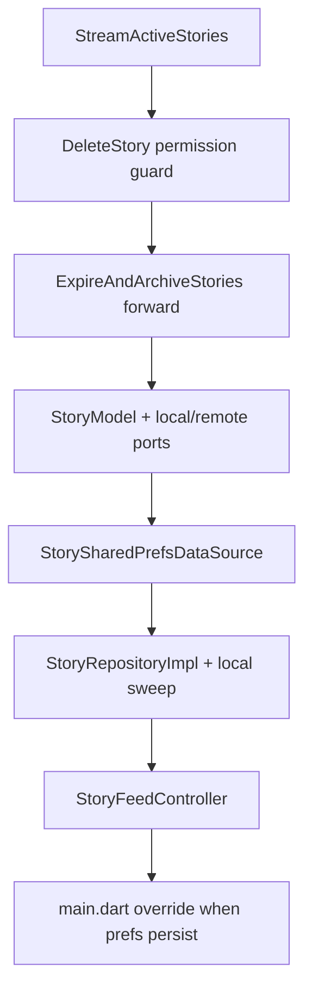

# Stories — Second Steps (Reference Guide)

> First steps landed the domain port and `PublishStory`. This week is the rest of Slice B **below the widgets**: remaining use cases, the data layer, and `StoryFeedController`.
>
> Stubs already sit at the DoD paths. Fill them. Do not rename. Do not add files this list does not name. Pattern from chat — open a provided file only when a step names it.

**PREREQS:** [`STORIES_FIRST_STEPS.md`](STORIES_FIRST_STEPS.md) through Step 6.

---

## 1. Slice B this week (Phase 3 DoD)

| Do | DoD |
| --- | --- |
| Remaining use cases | §2.2.3 |
| `StoryModel` + local DS + remote stub + `StoryRepositoryImpl` | §2.2.4 |
| Expiry sweep on the **repository** (local) | §2.2.5 |
| `StoryFeedController` (`AsyncValue` + stream) | §2.2.6 controller only |
| `storyRepositoryProvider` override in `main.dart` | §2 / app-root wiring |

| Do not | Why |
| --- | --- |
| Screens, widgets, `router.dart`, home-feed strip | §2.2.6 widgets / §2.2.7 / §2.2.8 |
| `BaseSettings` owner screen | §2.1.4 |
| Reactions, posts | Slice C |
| `image_picker` under `stories/` | `PickAndPersistMedia` already owns the picker |
| Cloud Function / Firestore expiry | Phase 3 is local-only. `remote == null`. Sweep lives in `StoryRepositoryImpl` |

Still bind: `{required local, this.remote}`; `syncStatus` defaults to `synced`; key `mb.stories.<baseId>`; `MediaRef media` singular; `Either<Failure, Unit>` not `void`; no `getStory`; no `dart:io` / `shared_preferences` outside `data/datasources/`.

---

## 2. Remaining use cases

| File | Class | Fill |
| --- | --- | --- |
| [`stream_active_stories.dart`](../lib/features/stories/domain/usecases/stream_active_stories.dart) | `StreamActiveStories` | Forward `repo.streamActive`. Not a `UseCase`. Do not filter here. |
| [`delete_story.dart`](../lib/features/stories/domain/usecases/delete_story.dart) | `DeleteStory` | `PermissionDeniedFailure` unless author **or** `actingRole.isOwnerOrAdmin`; else `repo.deleteStory(id)`. `authorUserId` on params. |
| [`expire_and_archive.dart`](../lib/features/stories/domain/usecases/expire_and_archive.dart) | `ExpireAndArchiveStories` | Forward `repo.expireAndArchive`. Sweep policy is not this file. |

**PROVIDED:** [`stream_messages.dart`](../lib/features/chat/domain/usecases/stream_messages.dart). Providers for these three already sit in [`story_providers.dart`](../lib/features/stories/presentation/providers/story_providers.dart).

---

## 3. Data layer

```
lib/features/stories/data/
  models/story_model.dart
  datasources/story_local_data_source.dart
  datasources/story_shared_prefs_data_source.dart
  datasources/story_remote_data_source.dart      # stay unimplemented
  repositories/story_repository_impl.dart
lib/features/bases/domain/repositories/base_settings_repository.dart
```

**PROVIDED:** [`message_model.dart`](../lib/features/chat/data/models/message_model.dart), [`chat_local_data_source.dart`](../lib/features/chat/data/datasources/chat_local_data_source.dart), [`chat_shared_prefs_data_source.dart`](../lib/features/chat/data/datasources/chat_shared_prefs_data_source.dart), [`chat_remote_data_source.dart`](../lib/features/chat/data/datasources/chat_remote_data_source.dart), [`chat_repository_impl.dart`](../lib/features/chat/data/repositories/chat_repository_impl.dart).

`StoryModel`: `fromMap` / `toMap` / `toEntity`. Wire JSON is blueprint §4.8 (`ttlMs`, nested `media`). Missing keys: `archived = false`, `syncStatus = synced`, `caption = null`. Relative `storageKey` only.

`StoryLocalDataSource` — dumb store, `String` ids, **no** expiry filter:

| Method | Notes |
| --- | --- |
| `publishStory` | Assign `id` + `createdAt` + `syncStatus: synced` here |
| `streamStories` / `listStories` | All rows for that base |
| `deleteStory` | By story id (id→baseId index, like chat's message-id map) |
| `writeStories` | Replace the list for one base; the sweep writes here |

`StoryRemoteDataSource`: same names as local. No bodies. `remote` stays `null`.

`StorySharedPrefsDataSource`: key `mb.stories.<baseId>`. `StreamController.broadcast()` per base; emit on every write.

`StoryRepositoryImpl`:

```dart
StoryRepositoryImpl({
  required this.local,
  required this.media,
  required this.settings,
  this.remote,
});
```

Mutations: `guard(() async { ... })` then `model.toEntity()`. `streamActive` / `listActive` drop expired **and** archived rows. Do not call `remote` while it is null.

`BaseSettingsRepository` this week is the **port only** (`get` / `update`). The sweep needs `get`.

### Expiry sweep (repo, not a Cloud Function)

On `publishStory`, on each `streamActive` tick, and from `expireAndArchive(baseId)`:

1. Read `BaseSettings` for that `baseId`.
2. For each stored row with `isExpired && !archived`:
   - `storiesArchiveEnabled == true` → persist `archived: true`
   - else → drop the row and `media.delete(storageKey)`
3. Do not revive an archived row if the clock moves backward.

---

## 4. `StoryFeedController`

**File:** [`story_feed_controller.dart`](../lib/features/stories/presentation/controllers/story_feed_controller.dart)

**PROVIDED:** [`chat_controller.dart`](../lib/features/chat/presentation/controllers/chat_controller.dart)

State: `active`, `archive`, `publishing`. One `state = state.copyWith(...)` per transition. `res.match` at this boundary only.

| Method | Calls |
| --- | --- |
| `load(baseId)` | `ListActiveStories`, `ListArchive` (pass current `BaseSettings`), then subscribe to `StreamActiveStories`. `_sub?.cancel()` first and in `dispose`. |
| `publish(...)` | `PublishStory` — pass `BaseSettings` in. Stream updates `active`. |
| `delete(...)` | `DeleteStory` — pass `authorUserId` + `actingRole`. |
| `sweepExpired(baseId)` | `ExpireAndArchiveStories` |

No ViewModels, no widgets. Do not override `storyRepositoryProvider` in `main.dart` until `StorySharedPrefsDataSource` actually persists.

---

## 5. Sequencing



Widgets, routes, Highlights, owner settings UI, and reactions are not this week.

---

## Related documents

- [`STORIES_FIRST_STEPS.md`](STORIES_FIRST_STEPS.md) — week one (domain).
- [`STORIES_FEATURE_REQUEST.md`](STORIES_FEATURE_REQUEST.md) — ticket.
- [`../docs/PHASE3_DOD_ACTION_LIST.md`](../docs/PHASE3_DOD_ACTION_LIST.md) — Slice B.
- [`../docs/PHASE3_POSTS_STORIES_REACTIONS_BLUEPRINT.md`](../docs/PHASE3_POSTS_STORIES_REACTIONS_BLUEPRINT.md) — §3.3 repository shape, §4.8 wire JSON.
