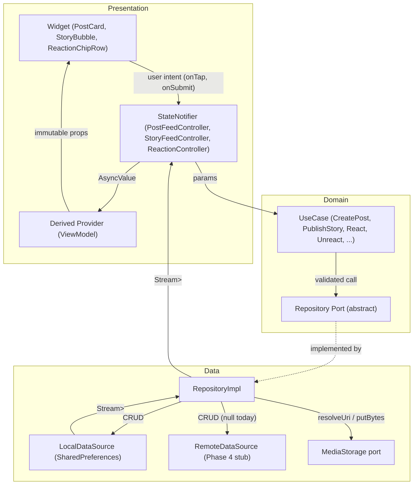
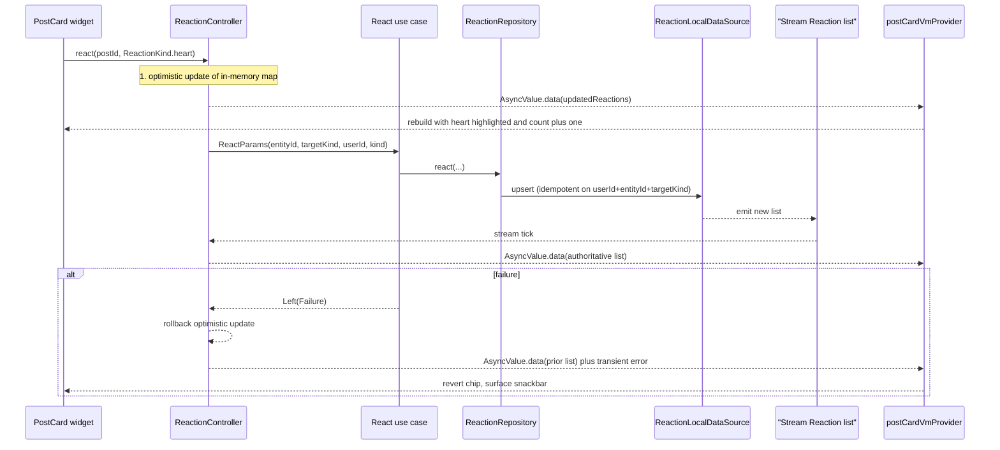
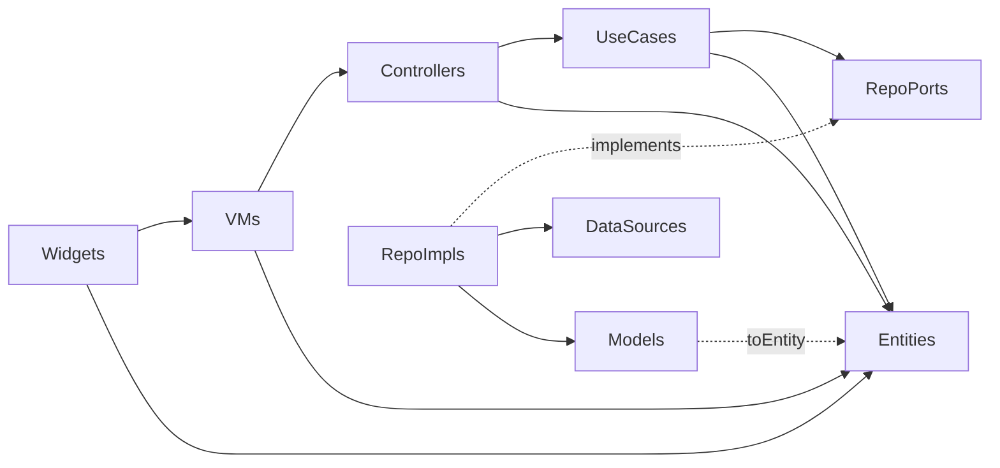
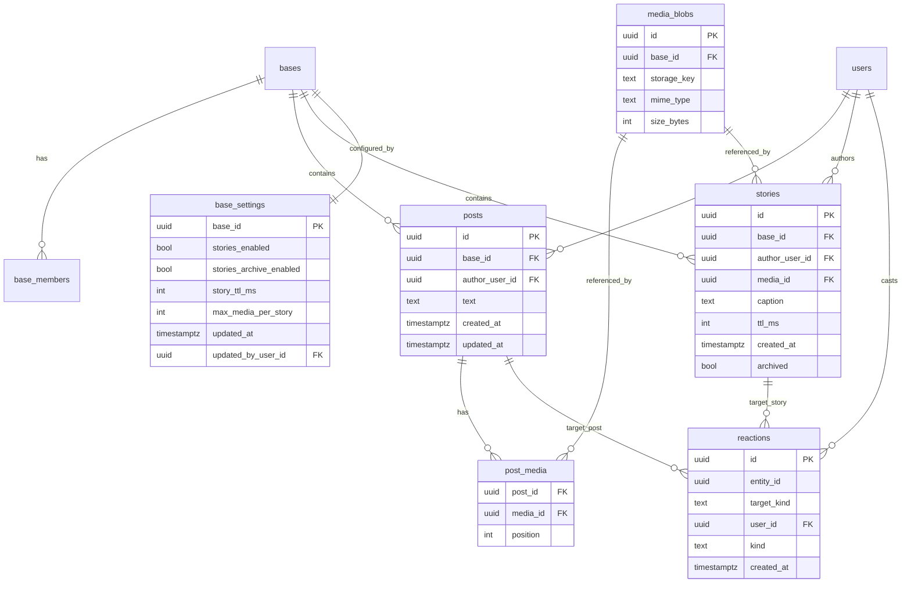

# Phase 3 — Posts, Stories & Reactions: Architectural Blueprint

**Status:** Locked 2026-06-12. Teaching artifact and implementation contract for the Phase 3 content slices (Posts, Stories, Reactions). Pairs with the slice-level checklist in [`PHASE3_DOD_ACTION_LIST.md`](PHASE3_DOD_ACTION_LIST.md) and the layered-architecture overview in [`REFACTOR_ARCHITECTURE.md`](phase2/REFACTOR_ARCHITECTURE.md).

**Audience:** Junior contributor focused on learning state management and architecture. Every rule below is load-bearing — deviation should be deliberate and documented in the PR.

---

## 1. Scope locked

| Subdomain | What ships |
| --- | --- |
| Posts | Text (≤ 1000 chars) + 0–10 `MediaRef`s, persistent in base feed, author/owner-deletable |
| Stories | Single `MediaRef` + optional caption (≤ 280 chars), 24h ephemeral by default, optional Highlights archive |
| Reactions | One reaction per `(user, target)`; MVP set: `like, heart, laugh, wow, sad, fire`; targets: `post`, `story` |
| Cross-cutting | Base isolation by construction, local-first persistence, cloud-ready ports, `AsyncValue`-based UDF |

**Out of scope (per Phase 3 DoD):** live streaming, voice notes, threaded replies, push notifications, in-app trim/edit, custom in-app camera surface, content moderation tooling, chat-message reactions.

---

## 2. State Management Flow (Unidirectional Data Flow)

The single mental model the junior must internalize: **events flow down, state flows up, never the other way.**

### 2.1 Layered UDF diagram



### 2.2 The three canonical states

Every list-bearing feature exposes exactly one piece of state shaped as `AsyncValue<List<Entity>>`. This matches the existing chat skeleton:

```77:83:moonbase_skeleton/lib/features/chat/presentation/controllers/chat_controller.dart
final chatControllerProvider = StateNotifierProvider<ChatController, ChatState>((ref) {
  return ChatController(
    ref.read(listMessagesUseCaseProvider),
    ref.read(sendMessageUseCaseProvider),
    ref.read(streamMessagesUseCaseProvider),
  );
});
```

- `AsyncValue.loading()` — emitted on `load(baseId)` entry and only then. UI shows `MoonSpinner` or skeleton.
- `AsyncValue.data(list)` — every subsequent stream tick replaces this. UI renders the list.
- `AsyncValue.error(failure, stackTrace)` — emitted on a failed `load` or stream error. UI shows a retryable error widget.

**Rule:** controllers never write into other controllers. They only push state outward.

### 2.3 Lifecycle of a single user intent (reactions worked example)



Three load-bearing pieces:

- **Optimistic update first, authoritative update second.** The widget reflects intent immediately, then the stream reconciles. Rollback only on `Left(Failure)`.
- **The stream is the source of truth.** Direct mutation of state inside the controller (without a corresponding repo write) is forbidden — it desyncs on the next refetch.
- **Failures are values, not exceptions.** Use cases return `Either<Failure, T>` (see [`lib/core/either.dart`](../lib/core/either.dart)); only at the controller boundary do they become `AsyncValue.error`.

### 2.4 Caching strategy

Phase 3 is local-only, so "cache" and "persistent store" are the same surface (`SharedPreferences`). The layering is shaped so Phase 4 cloud sync slots in without touching controllers or widgets.

| Tier | Where | Lifetime | Invalidation |
| --- | --- | --- | --- |
| L0: in-memory | Controller's `AsyncValue.data` list | Until `dispose()` | Replaced on every stream tick |
| L1: persistent | `SharedPreferences` keys `mb.posts.<baseId>`, `mb.stories.<baseId>`, `mb.reactions.<targetKind>.<entityId>` | Until uninstall | Writes from `*RepositoryImpl`; sweep job for expired stories |
| L1b: media blobs | `<docsDir>/media/<baseId>/<uuid>.<ext>` via [`MediaStorage`](../lib/features/media/domain/repositories/media_storage.dart) | Until uninstall (relative key survives reinstall via `resolveUri`) | Explicit `MediaStorage.delete` on post/story delete |
| L2: remote (Phase 4) | HTTP backend (Section 4) | TTL per resource | ETag or `updatedAt`; outbox replays rows where `syncStatus != synced` |

**Cache-key invariants:**

- Every persistence key is prefixed by `baseId`. No cross-base list ever exists at rest. This guarantees base isolation by construction.
- Every `MediaRef.storageKey` is relative (`<baseId>/<uuid>.<ext>`), never absolute. `resolveUri` is the only thing that knows the device docs dir.
- Reactions are indexed by `(targetKind, entityId)` for O(1) lookup when a post or story renders.

### 2.5 Streams, not refetches

`PostFeedController` and `StoryFeedController` subscribe to `Stream<List<...>>` from the repo, just like `ChatController` does today. Adding a row writes through the repo; the broadcast stream re-emits; controllers re-publish `AsyncValue.data`. Manual refetches are reserved for explicit pull-to-refresh and pagination.

**Pagination contract (posts only — stories are bounded by TTL):**

- `ListPostsParams { BaseId baseId; DateTime? before; int limit = 20; }`
- The controller appends to the existing list when `before != null`; replaces when `before == null`.

---

## 3. Front-end layering — ViewModel layer vs Data / Repository layer

The codebase already enforces a 3-layer Clean Architecture pattern (see [`REFACTOR_ARCHITECTURE.md`](phase2/REFACTOR_ARCHITECTURE.md)). This blueprint extends that pattern to the new features.

### 3.1 Import-direction diagram



**Hard rules:**

- **Domain depends on nothing in `data/` or `presentation/`.** Entities and use cases are pure Dart.
- **Data depends on Domain (to implement ports) but never on Presentation.**
- **Presentation depends on Domain only.** Controllers and ViewModels never import `data/`, `SharedPreferences`, `image_picker`, or `path_provider`.
- **Widgets are dumb.** They take VM props and emit intents. The only `ref.watch` allowed inside a leaf widget is `mediaStorageProvider` inside `MediaTile` — acceptable infrastructure exception, documented in [`PHASE3_DOD_ACTION_LIST.md`](PHASE3_DOD_ACTION_LIST.md) constraint #3.

### 3.2 Controllers vs ViewModels

A **Controller** holds raw state. A **ViewModel** is a screen-shaped projection of that state plus cross-feature dependencies. The junior should learn the distinction by mirroring the existing chat pattern in [`lib/features/chat/presentation/viewmodels/chat_screen_vm.dart`](../lib/features/chat/presentation/viewmodels/chat_screen_vm.dart) and [`lib/features/chat/presentation/providers/chat_screen_vm_provider.dart`](../lib/features/chat/presentation/providers/chat_screen_vm_provider.dart).

**Per-screen VM map:**

| Screen | Controller(s) | ViewModel | ViewModel provider responsibility |
| --- | --- | --- | --- |
| Base home feed | `StoryFeedController`, `PostFeedController` | `HomeFeedVM` | Combines selected base, current user, active stories, paginated posts, and "can publish?" booleans |
| Post compose | `PostFeedController` | `PostComposeVM` | Holds draft `_text`, staged `List<MediaRef>`, validation (`canSubmit`), submission error |
| Story capture | `StoryFeedController` | `StoryCaptureVM` | Holds picked `MediaRef`, caption draft, base TTL preview, `canPublish` |
| Story viewer | `StoryFeedController`, `ReactionController` | `StoryViewerVM` | Current story index, per-story progress, current user's reaction, counts grouped by kind |
| Story archive | `StoryFeedController` | `StoryArchiveVM` | Archived list (sorted desc), empty-state flag, gated on `BaseSettings.storiesArchiveEnabled` |
| Base settings (owner) | `BaseSettingsController` | `BaseSettingsVM` | Settings entity + `isOwner` from `BaseRole` |

**VMs are derived `Provider`s, never `StateNotifier`s.** They are pure functions of upstream providers. This is non-negotiable for testability — the junior should be able to construct a VM in a test by overriding only the upstream providers.

**Worked VM signature (not yet implemented):**

```dart
final postCardVmProvider = Provider.family<PostCardVM, PostId>((ref, postId) {
  final post = ref.watch(postByIdProvider(postId));
  final reactions = ref.watch(
    reactionsForProvider((postId.value, ReactionTargetKind.post)),
  );
  final currentUser = ref.watch(currentUserProvider);
  final isOwner = ref.watch(currentUserIsOwnerOfPostProvider(postId));
  return PostCardVM(
    post: post,
    grouped: ReactionGroup.from(reactions, currentUser?.id),
    canDelete: currentUser?.id == post?.authorUserId || isOwner,
  );
});
```

### 3.3 Repository shapes

Every repository follows the **same** shape established by `ChatRepositoryImpl`:

```10:14:moonbase_skeleton/lib/features/chat/data/repositories/chat_repository_impl.dart
class ChatRepositoryImpl implements ChatRepository {
  ChatRepositoryImpl({required this.local, this.remote});

  final ChatLocalDataSource local;
  final ChatRemoteDataSource? remote;
```

| Repository | Local source (Phase 3) | Remote source (Phase 4 stub) | Notes |
| --- | --- | --- | --- |
| `PostRepository` | `PostSharedPrefsDataSource` keyed by `mb.posts.<baseId>` | `PostRemoteDataSource` abstract | Paginated list + broadcast stream |
| `StoryRepository` | `StorySharedPrefsDataSource` keyed by `mb.stories.<baseId>` | `StoryRemoteDataSource` abstract | Filters expired on every read; archives or hard-deletes per base setting |
| `ReactionRepository` | `ReactionSharedPrefsDataSource` keyed by `mb.reactions.<targetKind>.<entityId>` | `ReactionRemoteDataSource` abstract | Upsert with `(userId, entityId, targetKind)` uniqueness |
| `BaseSettingsRepository` | `BaseSettingsSharedPrefsDataSource` keyed by `mb.baseSettings.<baseId>` | (none this phase) | Owner-only mutations |

### 3.4 Models vs entities

The data layer owns `*Model` classes with `fromMap` / `toMap`. They are JSON-shaped. The domain layer owns entity classes that are pure value objects with typed IDs (`PostId`, `StoryId`, `ReactionId`, see [`lib/core/ids.dart`](../lib/core/ids.dart)). Conversion is one-way at the repo boundary (`model.toEntity()`); presentation never sees a model.

### 3.5 The repository is the only layer that knows about `MediaStorage`

Use cases pass `List<MediaRef>` around as already-persisted references. The pick-and-persist flow runs in the compose ViewModel via `PickAndPersistMedia` (see [`lib/features/media/domain/usecases/pick_and_persist_media.dart`](../lib/features/media/domain/usecases/pick_and_persist_media.dart)), so by the time `CreatePost` is called, all media bytes are on disk and the post just stores the keys.

### 3.6 Error mapping at the boundary

Use cases and repos return `Either<Failure, T>`. The controller is the **only** layer that translates this into `AsyncValue.error`:

```dart
final res = await _createPost(params);
state = res.match(
  (f) => state.copyWith(submitting: AsyncValue.error(f, StackTrace.current)),
  (post) => state.copyWith(submitting: const AsyncValue.data(null)),
);
```

This is the recurring drill — every controller method ends in a `res.match(...)` and never throws.

---

## 4. Back-end API contract & data model (Phase 4-ready)

The Phase 3 build is local-only, so this contract is **shaped, not implemented**. Stubs already exist as abstract `*RemoteDataSource` classes (see [`lib/features/chat/data/datasources/chat_remote_data_source.dart`](../lib/features/chat/data/datasources/chat_remote_data_source.dart) for the pattern). The contract below is what the junior would implement once a server lands.

### 4.1 Transport & conventions

- **Protocol:** REST + JSON over HTTPS for CRUD; WebSocket channel (`/v1/realtime?baseId=...`) for broadcast deltas.
- **Auth:** `Authorization: Bearer <jwt>` containing `{ userId, exp }`. Server resolves base memberships per request.
- **Base isolation:** every resource path is prefixed by `/bases/{baseId}/`. Server rejects with `403 NotABaseMember` if the JWT subject isn't a current member.
- **Idempotency:** `POST` writes accept an `Idempotency-Key` header (client supplies the entity UUID generated locally) so retries don't duplicate.
- **Time:** ISO-8601 UTC, server-authoritative on `createdAt` / `updatedAt`.
- **Pagination:** cursor-based; `?before=<iso8601>&limit=<n>`.
- **Errors:** `{ "error": "code_snake_case", "message": "human" }`; HTTP status carries the class. Maps 1:1 to `Failure` subclasses in [`lib/core/failure.dart`](../lib/core/failure.dart).

### 4.2 REST endpoints — Posts

| Method | Path | Request body | Response | Notes |
| --- | --- | --- | --- | --- |
| `POST` | `/v1/bases/{baseId}/posts` | `{ id, text?, mediaKeys: string[] }` | `201 Post` | `id` is client-generated UUID; server validates `text<=1000`, `mediaKeys<=10`, at least one non-empty |
| `GET` | `/v1/bases/{baseId}/posts` | — | `200 { items: Post[], nextBefore?: iso8601 }` | Cursor pagination |
| `GET` | `/v1/bases/{baseId}/posts/{postId}` | — | `200 Post` | |
| `DELETE` | `/v1/bases/{baseId}/posts/{postId}` | — | `204` | Author or owner/admin only |

### 4.3 REST endpoints — Stories

| Method | Path | Request body | Response | Notes |
| --- | --- | --- | --- | --- |
| `POST` | `/v1/bases/{baseId}/stories` | `{ id, mediaKey, caption?, ttlMs? }` | `201 Story` | Server clamps `ttlMs` to `BaseSettings.storyTtl` window |
| `GET` | `/v1/bases/{baseId}/stories?scope=active` | — | `200 Story[]` | Server filters expired |
| `GET` | `/v1/bases/{baseId}/stories?scope=archive` | — | `200 Story[]` | `404` if `storiesArchiveEnabled=false` |
| `DELETE` | `/v1/bases/{baseId}/stories/{storyId}` | — | `204` | Author or owner/admin only |

### 4.4 REST endpoints — Reactions

| Method | Path | Request body | Response | Notes |
| --- | --- | --- | --- | --- |
| `PUT` | `/v1/reactions/{targetKind}/{entityId}` | `{ kind }` | `200 { reaction: Reaction, counts: Record<ReactionKind, int> }` | Upsert: replaces the caller's prior reaction on the same target (one-per-user invariant) |
| `DELETE` | `/v1/reactions/{targetKind}/{entityId}` | — | `200 { counts: Record<ReactionKind, int> }` | Toggle-off |
| `GET` | `/v1/reactions/{targetKind}/{entityId}` | — | `200 { reactions: Reaction[], counts: Record<ReactionKind, int>, mine?: ReactionKind }` | Used on initial render of a post/story |

### 4.5 REST endpoints — Base settings

| Method | Path | Request body | Response | Notes |
| --- | --- | --- | --- | --- |
| `GET` | `/v1/bases/{baseId}/settings` | — | `200 BaseSettings` | |
| `PATCH` | `/v1/bases/{baseId}/settings` | Partial `BaseSettings` | `200 BaseSettings` | Owner/admin only; `403 PermissionDenied` otherwise |

### 4.6 REST endpoints — Media

| Method | Path | Request body | Response | Notes |
| --- | --- | --- | --- | --- |
| `POST` | `/v1/bases/{baseId}/media:signedUpload` | `{ key, mimeType, sizeBytes }` | `200 { putUrl, getUrl, expiresAt }` | Client `PUT`s bytes directly to object storage; server never streams blobs |
| `DELETE` | `/v1/bases/{baseId}/media/{key}` | — | `204` | |

The signed-URL flow is the Phase 4 replacement for `LocalFileMediaStorage.putBytes`. The `MediaStorage` port is unchanged; only the concrete adapter swaps.

### 4.7 Realtime channel

Single WebSocket per base subscription:

- Client connects to `wss://.../v1/realtime?baseId=...` with the same bearer token.
- Server pushes typed envelopes:

```json
{ "type": "post.created", "data": { "...": "Post" } }
{ "type": "post.deleted", "data": { "id": "..." } }
{ "type": "story.created", "data": { "...": "Story" } }
{ "type": "story.expired", "data": { "id": "...", "archived": true } }
{
  "type": "reaction.changed",
  "data": {
    "targetKind": "post",
    "entityId": "...",
    "counts": { "heart": 3, "fire": 1 },
    "userIdsByKind": { "heart": ["u1","u2","u3"], "fire": ["u4"] }
  }
}
```

The remote data sources expose a `Stream<List<Entity>>` mirroring the local stream contract, so `*RepositoryImpl` can merge local and remote updates without touching controllers.

### 4.8 Wire DTOs

These match the on-disk `*Model` JSON shapes so client-side migration is a no-op.

**Post**

```json
{
  "id": "p_01HM...",
  "baseId": "b_01HM...",
  "authorUserId": "u_01HM...",
  "text": "string|null",
  "media": [],
  "createdAt": "2026-06-12T18:00:00Z",
  "updatedAt": "2026-06-12T18:00:00Z",
  "syncStatus": "synced"
}
```

**Story**

```json
{
  "id": "s_01HM...",
  "baseId": "b_01HM...",
  "authorUserId": "u_01HM...",
  "media": {},
  "caption": "string|null",
  "ttlMs": 86400000,
  "createdAt": "2026-06-12T18:00:00Z",
  "archived": false,
  "syncStatus": "synced"
}
```

**MediaRef** (wire form mirrors [`lib/features/media/domain/entities/media_ref.dart`](../lib/features/media/domain/entities/media_ref.dart))

```json
{
  "id": "m_01HM...",
  "type": "image|video",
  "storageKey": "<baseId>/<uuid>.<ext>",
  "thumbnailKey": "string|null",
  "width": 1080,
  "height": 1920,
  "durationMs": 4200,
  "sizeBytes": 1048576,
  "mimeType": "image/jpeg",
  "syncStatus": "synced"
}
```

**Reaction**

```json
{
  "id": "r_01HM...",
  "entityId": "p_01HM...",
  "targetKind": "post|story",
  "userId": "u_01HM...",
  "kind": "like|heart|laugh|wow|sad|fire",
  "createdAt": "2026-06-12T18:00:00Z"
}
```

**BaseSettings**

```json
{
  "baseId": "b_01HM...",
  "storiesEnabled": true,
  "storiesArchiveEnabled": true,
  "storyTtlMs": 86400000,
  "maxMediaPerStory": 1,
  "updatedAt": "2026-06-12T18:00:00Z",
  "updatedByUserId": "u_01HM..."
}
```

### 4.9 Server-side data model (logical)

PostgreSQL is the assumed backing store; columns are illustrative for the junior to reason about indexes and isolation, not a final DDL.



**Indexes the junior should be able to justify:**

- `posts (base_id, created_at DESC)` — feed pagination.
- `stories (base_id, archived, created_at)` partial index `WHERE archived = false` — active feed.
- `reactions (target_kind, entity_id)` — chip-row hydration in one query.
- `UNIQUE (user_id, entity_id, target_kind)` on `reactions` — enforces one-per-user at the DB layer (same invariant the client enforces).
- `base_members (base_id, user_id)` — authorization filter on every request.

### 4.10 Authorization matrix

| Action | Allowed if |
| --- | --- |
| `GET` posts / stories / reactions for `baseId` | `base_members.role IN (owner, admin, member)` |
| `POST` post / publish story | same |
| `DELETE` post / story | `userId == authorUserId` OR `role IN (owner, admin)` |
| `PATCH` base settings | `role IN (owner, admin)` |
| `PUT` / `DELETE` reaction | `base_members.role IN (owner, admin, member)` of the **target's** base (server resolves baseId from `entity_id`) |

**Failure mapping** (server `error` code → client `Failure` subclass in [`lib/core/failure.dart`](../lib/core/failure.dart)):

- `not_a_base_member`, `not_owner` → `PermissionDeniedFailure`
- `media_too_large` → `MediaTooLargeFailure`
- `media_too_long` → `MediaTooLongFailure`
- `media_unsupported` → `MediaUnsupportedFailure`
- `validation_failed` → `ValidationFailure`
- 5xx, network → `NetworkFailure`
- Anything else → `UnknownFailure`

### 4.11 Local-to-cloud sync semantics

The `syncStatus` field on every persisted entity is the contract that makes Phase 3 → Phase 4 mechanical (see [`lib/core/sync_status.dart`](../lib/core/sync_status.dart)):

- Phase 3 writes are `synced` (no server exists; local is authoritative).
- Phase 4 writes are `localOnly` until the outbox replays; the worker `PUT`s with `Idempotency-Key = entity.id` and flips to `synced`.
- Conflict policy: last-write-wins on `updatedAt` for posts and settings; reactions are last-write-wins per `(userId, entityId, targetKind)`; stories are immutable post-publish (only `archived` flips).

---

## 5. What the junior demonstrates by shipping this

- **UDF discipline** — every screen has exactly one `StateNotifier`, one `AsyncValue`, one derived VM.
- **Layered Clean Architecture** — physically separating entities, ports, adapters, and widgets, and feeling the friction when imports cross layers.
- **Ports and adapters in practice** — swapping `LocalFileMediaStorage` for a future cloud impl with zero call-site changes.
- **`Either` vs `AsyncValue`** — when failures are values vs when they're rendered state.
- **Optimistic UI with rollback** — the reactions slice is the perfect microcosm.
- **Base isolation by construction** — every key prefixed, no global lists.
- **API contract design before implementation** — writing the wire DTOs and authorization matrix before the server exists.

---

## 6. Appendix: mapping this spec to Phase 3 DoD slices

| Spec section | DoD slice / section | Notes |
| --- | --- | --- |
| Section 2 State Management Flow | DoD constraint #3 ("Single source of truth, dumb tiles") | Codifies the `AsyncValue` + stream-of-truth rule for both new feeds |
| Sections 3.1–3.2 Layering / VMs | DoD Section 2.2.6 (stories presentation), Section 3.1.4 (posts presentation) | Defines per-screen VMs the slices must construct |
| Section 3.3 Repository shapes | DoD Section 2.2.4 (`StoryRepositoryImpl`), Section 3.1.2 (`PostRepositoryImpl`), Section 3.2.3 (`ReactionRepositoryImpl`) | Locks the `{required local, this.remote}` constructor pattern |
| Section 3.5 Media flow | DoD Section 0.3 (`media` shared module), Section 1 Slice A precedent | Confirms `PickAndPersistMedia` runs in compose VMs, not repos |
| Sections 4.2–4.6 REST endpoints | DoD constraint #1 ("Local-first, cloud-ready") | Defines the Phase 4 contract the `*RemoteDataSource` stubs must implement |
| Section 4.7 Realtime channel | DoD Section 2.2.6 (`story_feed_controller` stream subscription) | Shows how the cloud stream merges into the same controller surface |
| Section 4.9 Server data model | DoD Section 3.1 (`Post`), Section 2.2.1 (`Story`), Section 3.2.1 (`Reaction`) | One-to-one with the domain entities the slices build |
| Section 4.10 Authorization matrix | DoD Section 2.1.3 (role-checked use cases), constraint #5 ("Permission-bounded mutations") | Anchors the `BaseRole` checks the use cases perform |
| Section 4.11 Sync semantics | DoD Section 0.2.1 (`SyncStatus`), constraint #1 | Explains why every entity carries `syncStatus = synced` today |

---

*Phase 3 — Posts, Stories & Reactions Architectural Blueprint. Locked 2026-06-12. Treat as living until Phase 3 sign-off; cite section numbers in PR descriptions when implementing the related slice.*
